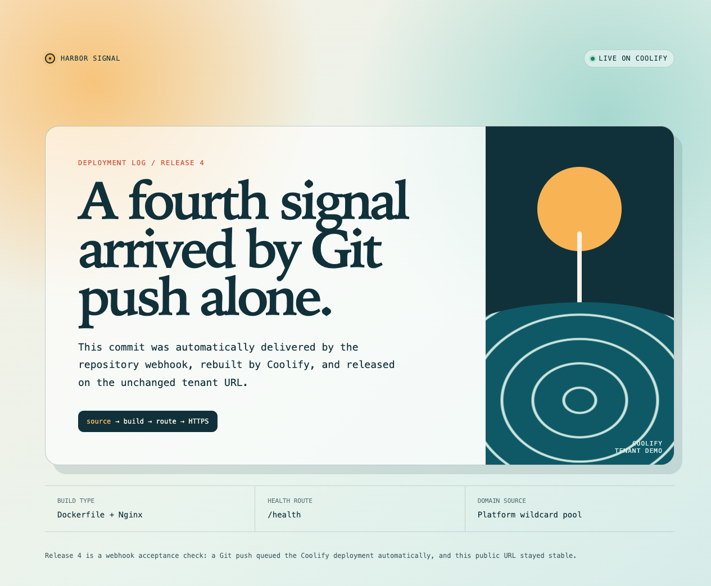
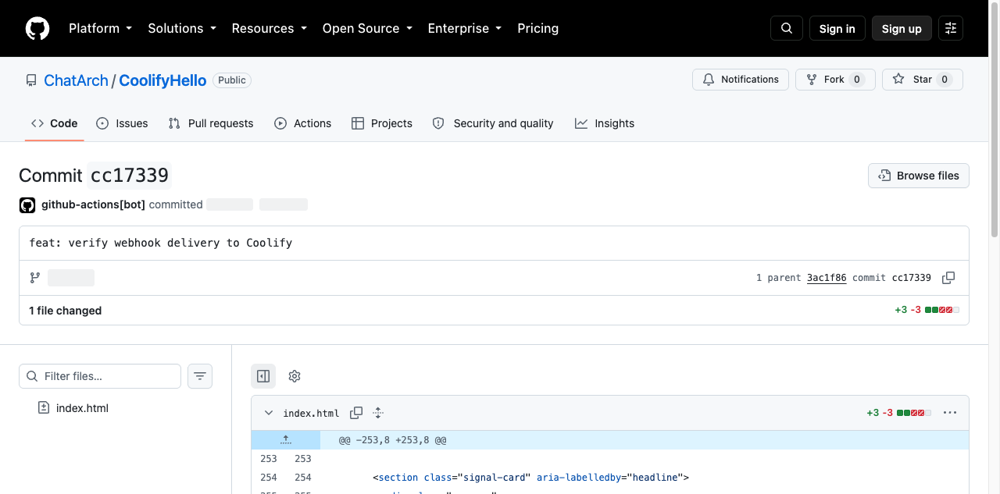

# 真实演示：从 Git 到公网 URL

这不是示意流程。下面的页面来自一次真实的 Coolify 部署：源码推送后，平台构建 Dockerfile、保留同一个自动分配的 tenant 域名，并通过 HTTPS 提供访问。

<div class="grid cards" markdown>

-   :material-source-repository: **公开源码**

    ---

    [ChatArch/CoolifyHello](https://github.com/ChatArch/CoolifyHello) 是这个案例的真实 Git 仓库。

-   :material-web-check: **稳定公网地址**

    ---

    [打开已上线的 Release 4](https://4l9ubgtzlqsgodsrgetut8kp.cool.wzhecnu.cn/)，或访问 [健康检查](https://4l9ubgtzlqsgodsrgetut8kp.cool.wzhecnu.cn/health)。

-   :material-clock-check-outline: **可回读的部署**

    ---

    初始提交和最终 [Release 4 提交](https://github.com/ChatArch/CoolifyHello/commit/cc1733959e8b7ccb06683064b614f153e4cdc371) 都由 Coolify 构建；Release 4 由 GitHub push webhook 自动排队，公网 URL 未改变。

</div>



公开仓库中的最终提交也可独立回读：



## 这证明了什么

一次性平台配置完成后，后续项目不需要逐条新增 DNS 记录、Nginx 规则或人工发证书：

```text
*.cool.wzhecnu.cn
        │
        └── Coolify 为新应用生成唯一 application UUID
                  │
                  └── <application-uuid>.cool.wzhecnu.cn
                           │
                           └── 构建、部署、HTTPS、健康检查与回滚记录
```

默认地址是技术上稳定且无冲突的 UUID 子域名，而不是人工挑选的名称。项目也可以在完成验证后再绑定自己的自定义域名。

!!! note
    Coolify 内部会记录自动生成的应用地址。终端用户应始终访问 `https://` 公网 URL；不需要了解底层代理或 DNS 实现。

## 用户实际操作

### 1. 创建并推送源码

这个 Demo 是一个极小的 Dockerfile 应用，入口只需要一个 `index.html`、一个 Nginx 配置和 Dockerfile：

```dockerfile
FROM nginx:1.27-alpine
COPY nginx.conf /etc/nginx/conf.d/default.conf
COPY index.html /usr/share/nginx/html/index.html
EXPOSE 80
```

推送到 Git：

```bash
git init -b main
git add .
git commit -m "feat: first public page"
git remote add origin https://github.com/OWNER/REPOSITORY.git
git push -u origin main
```

### 2. 创建 Project 并读取 Environment

先创建 Project，再读取其由 Coolify 创建的 `production` Environment。所有写入都必须显式提供 `--allow-write`：

```bash
chatcoolify --allow-write project-create "My website" \
  --description "Public website"

chatcoolify project PROJECT_UUID
```

第二条命令返回 `environments`；取出 `production` 的 UUID。

### 3. 先生成无副作用计划

关键点是**不传 `--domain`**。计划会明确包含 `"autogenerate_domain": true`，由平台从 `cool` 域名池分配唯一地址：

```bash
chatcoolify website-plan \
  --project-uuid PROJECT_UUID \
  --server-uuid SERVER_UUID \
  --environment-uuid ENVIRONMENT_UUID \
  --repository-url https://github.com/OWNER/REPOSITORY.git \
  --build-pack dockerfile \
  --port 80 \
  --health-check-path /health \
  --name my-website
```

### 4. 确认后创建并部署

确认 Project、Server、Environment、仓库和 Build Pack 后，执行同一份参数：

```bash
chatcoolify --allow-write website-create \
  --project-uuid PROJECT_UUID \
  --server-uuid SERVER_UUID \
  --environment-uuid ENVIRONMENT_UUID \
  --repository-url https://github.com/OWNER/REPOSITORY.git \
  --build-pack dockerfile \
  --port 80 \
  --health-check-path /health \
  --name my-website \
  --deploy
```

返回的应用 UUID 是读取自动域名、状态、部署历史和后续部署的稳定标识：

```bash
chatcoolify application APPLICATION_UUID
chatcoolify deployments APPLICATION_UUID
chatcoolify --allow-write deploy APPLICATION_UUID
```

`application` 输出中的 `fqdn` 是 Coolify 分配的地址；公网入口会把 HTTP 自动升级为 HTTPS。

## 源码更新如何上线

这个真实案例的最终自动发布遵循以下路径：

1. 修改 `index.html` 中的 Release 文案；
2. `git commit` 并 `git push origin main`；
3. GitHub push webhook 自动通知 Coolify；
4. Coolify 自动排队、构建并完成该提交的部署，部署记录标记为 `is_webhook=true`；
5. 同一个 HTTPS 地址返回 Release 4 页面和 `/health`；
6. `chatcoolify deployments APPLICATION_UUID` 返回该提交的 `finished` 状态。

已配置 Git Provider webhook 的仓库不需要 Agent 或用户再调用 deploy。若仓库尚未配置 webhook，授权用户仍可在 Coolify UI 或通过显式 `chatcoolify --allow-write deploy` 触发；两种方式都不会改变平台分配的 URL。

## 验收清单

```bash
curl --fail https://APPLICATION_UUID.cool.wzhecnu.cn/health
curl --fail https://APPLICATION_UUID.cool.wzhecnu.cn/
chatcoolify deployments APPLICATION_UUID
```

确认：

- 自动分配的 URL 首次部署后可访问；
- HTTPS 证书覆盖 tenant 子域名；
- 源码新提交被构建为新的部署记录；
- 同一 URL 返回新页面；
- 健康检查、失败状态和旧部署记录都可读取；
- 不需要为每个项目单独改 DNS 或反向代理。

## 安全边界

- `--allow-write` 是 ChatCoolify 的本地防误操作门，不替代 Coolify Token 的服务端权限。
- 普通用户只能操作自己被授权的 Team 和资源；不能借由自动域名访问其他 Team 的应用。
- 自动 tenant 域名适合快速上线和演示；生产自定义域名、OAuth 回调和 Cookie 域策略仍应在应用验证后单独评审。
